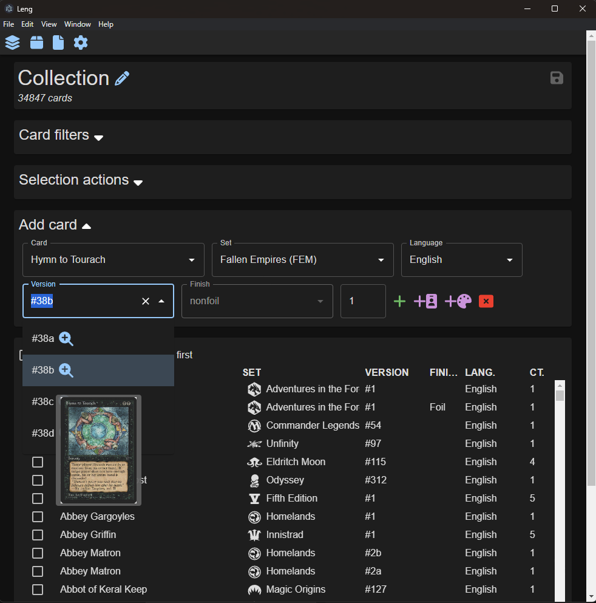
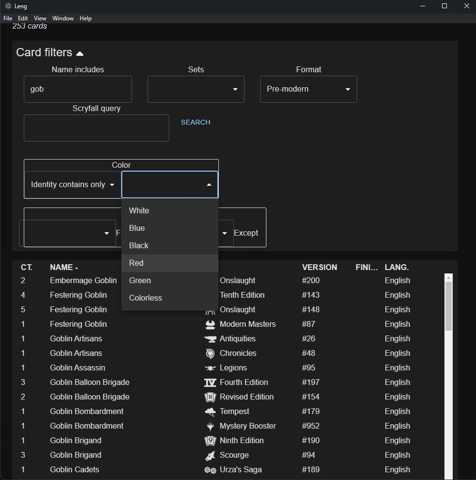
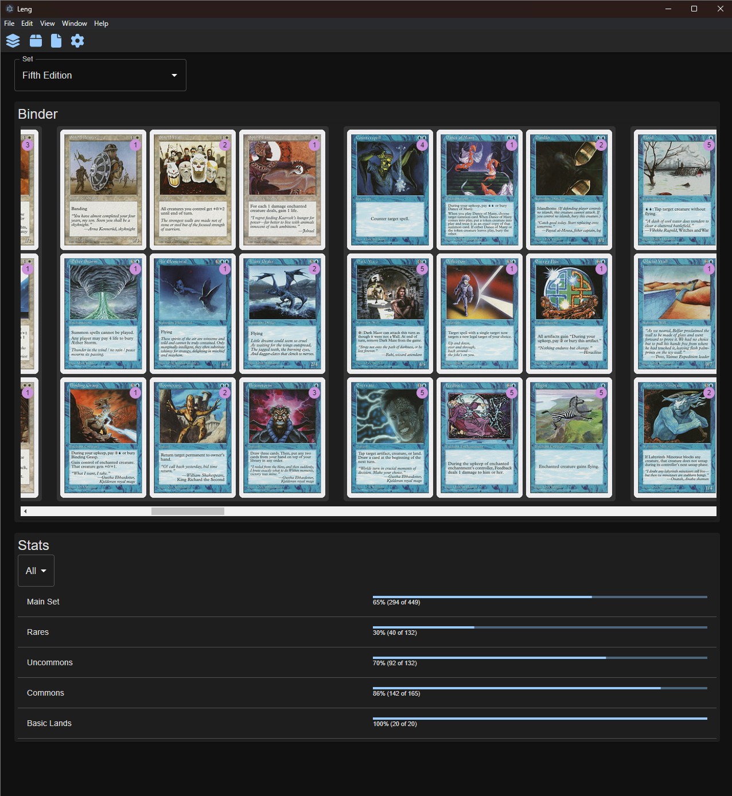

# Leng

Leng is a desktop app for keeping track of your *Magic: the Gathering* collection.

*Illus. Daniel Gelon*

## Features

### Streamlined and safe data entry

* More guardrails than a spreadsheet
    * Auto-complete for card and set names
    * Card entry form designed for efficient use without mouse
    * Only valid selections allowed (ex: You cannot add a foil version of a card not printed in foil.)
* Avoids pitfalls of mobile scanner apps
    * Image processing is slow
    * Image processing drains phone batteries quickly
    * Image capture requires holding a phone steady, which is tiring when many cards are involved
    * Image capture is prone to glare and lighting problems
    * Image recognition frequently misidentifies set symbols, which requires manual correction
* Support for alternate arts, finishes, and languages

### Advanced search features for deckbuilding

* Multiple options for color filters, including color identity
* Filter by format legality, including block constructed formats
* Full support for Scryfall query syntax

### Collector set reports

* Virtual binder display for cards you own in each set
* Stats like % collected by rarity
* Generate checklist

## Screenshots

### Data entry

### Search

### Collector set report

## Tech stack

* TypeScript
* React
* Redux
* Electron
* Material UI
* Sass

## Local dev setup

1. Requires 

    * NodeJS 18
    * NPM 8

2. Install dependencies with 
    
    * `npm ci`

3. Build and start app
    * `npm start` will build and start the app
    * `npm run watch` will build the app and rebuild when any changes are made, but will not start the Electron host. This is useful when developing any changes that are not part of the Electron configuration.
    * `npm run serve` will start the Electron host, but requires that it has already been built.
    * For most development, running `watch` and `serve` in different terminal windows is ideal for fast feedback.

4. Adjust settings
    * When the app starts, click the settings (gear) button.
    * Set the data path to something like `C:\users\your.name\leng`.
    * This is where any data files are saved, including your collection and cached data from Scryfall.
